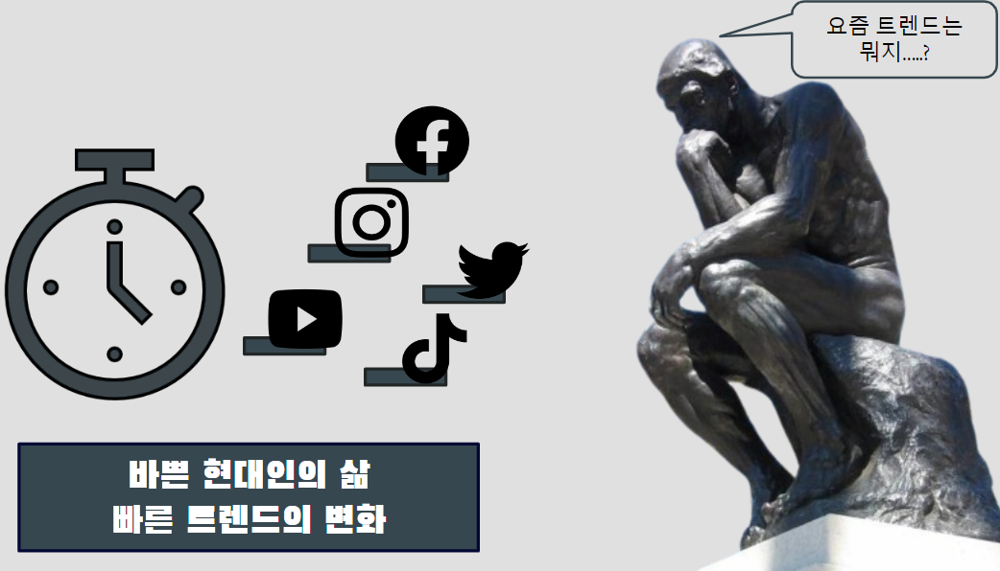

# '랭킹박스'(RankingBox) - 트렌드 랭킹
- 실시간으로 핫한 컨텐츠들을 모아 보여주는 서비스.
- 개발기간 : 2023/11/20 ~ 2023/12/08
- 인원 : 5명
## 프레임워크 / 언어 / 개발환경
- Spring Legacy / Java / STS
## 시연동영상
https://youtu.be/F-7U2uUm3aY?si=HtSKNcBCeUgTa4Z7
## 개요

  

만약 우리가 요즘 트렌드에 대해 알고싶어 한다면 우리는 많은 SNS, 스트리밍 사이트를 돌며 
많은 시간을 투자해야 합니다.  하지만 요즘 같이 바쁜 현대사회에서 시간은 그렇게 여유 있지 않습니다. 그래서 “사이트 마다 가장 인기 있는 게시물을 모아 한눈에 볼 수 있으면 좋지 않을까?” 라는
생각에 기획.

## 목표시스템

  

## 요구사항분석

  

## ERD

  

## 화면설계

  

  

  

  

  

  

  

  

  

  

